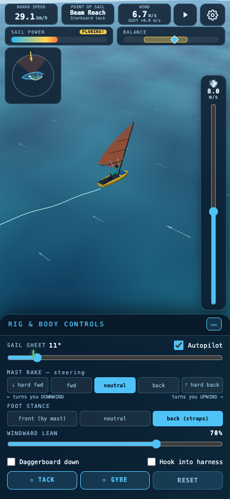

# 🏄 Windsurf Simulator

A 3D browser game that teaches the **real mechanics of windsurfing**. You control the same
levers a real windsurfer has — sheet angle, mast rake, foot stance, body lean, daggerboard,
harness — and the board responds the way a real one would. No rudder, no arcade shortcuts:
you steer by trimming the sail, you plane when the physics say you can, and you get catapulted
when you get greedy with the power.

**▶ Play it in your browser: <https://viachm.github.io/windsurf-simulator/>**

It's a static, no-build web app (three.js + vanilla JS). Nothing to install to play — just
open the link. Works on desktop and touch/mobile, in 20 UI languages.

> ⚠️ It's a *learning toy*, not a certified trainer. The physics are a faithful simplification
> meant to build intuition, not to replace time on the water.

<p align="center">
  <a href="https://viachm.github.io/windsurf-simulator/">
    
  </a>
</p>

## Run it locally

Any static server works. From this directory:

```bash
python3 -m http.server 8737
# open http://localhost:8737
```

(Needs internet on first load — three.js is pulled from a CDN.)

## The physics it models

| Real mechanic | In the game |
|---|---|
| Sail = airfoil; angle of attack controls lift | **Sheet slider** vs. the moving green "optimal trim" tick. Too far out → luffing (flaps, no power). Too far in → stall (heel force, no drive). |
| Apparent wind swings forward as you accelerate | Optimal trim tick moves toward 0° as you speed up — you must keep sheeting in. Drive dies if the apparent wind reaches the bow (natural top speed). |
| No rudder — steer by moving the sail's centre of effort | **Mast rake**: back → luff up (turn upwind), forward → bear away (turn downwind). |
| No-go zone (~45° either side of the wind) | Sail cannot drive there; you stop and drift backwards ("in irons"). |
| Sideways pull must be countered by the rider | **Windward lean** slider + balance meter. Too little lean vs. power → **catapult**. Too much lean when power dies → fall in backwards. |
| Daggerboard resists leeway at low speed, but lifts violently at high speed | Down: little sideways drift. Up: you slip sideways when slow. Down **while planing** → spinout crash. |
| Planing: above a speed/power threshold the hull skims and drag collapses | Reach ~8 kn with good power on a beam/broad reach → PLANING badge, big acceleration. Then you must move back into the straps or you'll pearl the nose. |
| Harness carries the load but commits you | +38% effective lean, but gusts fling you faster if overpowered. Hooking in requires actual pull in the sail. |
| Tacking / gybing | Scripted maneuvers with realistic entry conditions (tack needs speed + an upwind-ish course; gybe starts from a broad reach). Sailor switches sides. |
| Gusts and wind shifts | True wind oscillates ±15% and wanders ±6°; watch the GUST indicator. |

## Controls

| Input | Action |
|---|---|
| `W` / `S` | Sheet in / out |
| `◀` / `▶` | Rake mast back (upwind) / forward (downwind) — momentary |
| `Q` / `E` | Less / more windward lean |
| `1` `2` `3` | Stance: front / neutral / back straps |
| `D` | Daggerboard up/down |
| `H` | Hook in/out of harness |
| `T` / `G` | Tack / Gybe |
| `R` | Reset |
| Mouse drag / scroll | Orbit / zoom camera |

Everything is also clickable in the right-hand panel. "Smart interlocks" refuse
impossible combinations (hooking into a powerless sail, back straps with no speed, …)
and explain why in the hint bar.

## Language

**20 languages**: English, Українська, Deutsch, Français, Español, Italiano, Português,
Nederlands, Polski, Čeština, Svenska, Dansk, Suomi, Ελληνικά, Türkçe, Bahasa Indonesia,
Русский, 中文, 日本語, 한국어. The app picks your browser language on first load; the
button in the bottom-left corner switches it, and the choice is remembered in `localStorage`.

All strings live in `src/i18n.js` — add a language by adding another entry to `STRINGS`.
English and Ukrainian are hand-written; the other 18 are AI-translated and not yet
reviewed by native speakers, so corrections via pull request are very welcome.

## Files

- `src/sim.js` — physics: apparent wind, sail lift curve, points of sail, planing, balance, crashes
- `src/world.js` — three.js scene: sea shader, wind streaks, board/rig/sailor, splash & wake
- `src/ui.js` — control panel, interlock rules, HUD meters, compass
- `src/i18n.js` — translation tables (20 languages) + language toggle
- `src/demo.js` — the guided auto-sailing demo tour
- `src/main.js` — game loop

## Built with

- [three.js](https://threejs.org/) (r160, via CDN) for the WebGL scene
- Plain ES modules — **no build step, no bundler, no framework**. Edit a file, reload the page.
- Deployed as static files on GitHub Pages.

## Contributing

Issues and pull requests are welcome — especially:

- **Translation fixes** for any of the 18 AI-translated languages (see `src/i18n.js`).
- Physics tweaks that make a mechanic feel more true to life.

There's no build to run; open `index.html` through any static server and edit.

## License

Released under the [MIT License](LICENSE) — free to use, modify, and build on,
including in commercial projects. The only condition is to keep the copyright
notice. Do whatever you like with it; a mention is appreciated but not required.

## Author

Made by **Viacheslav Mukha**, with help from Claude (Anthropic).
